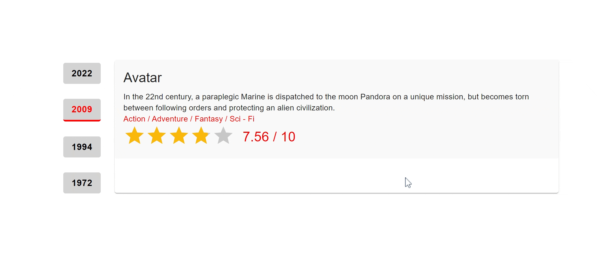

# Film Rating Project

This project allows the user to navigate among movies from specific years and rate each movie with a star rating. Movies are listed with details such as title, description, tags, and rating. When a user selects a movie, more information about the movie is displayed, and the user can rate the movie using a star rating system.

## Features

- The list of all movies is organized by years and displayed with buttons.
- When a user selects any movie, detailed information is shown on a card.
- The user can rate the movies using star ratings.

## Technologies Used

- React: Used for creating the user interface.
- Material-UI: Used for UI components.
- react-simple-star-rating: Used for star rating.

## How to Run?

1. Clone the project to your computer.
2. Navigate to the project folder and open the terminal.
3. Run `npm install` command to install the necessary dependencies.
4. Use `npm start` command to run the project. The application will be available at http://localhost:3000.

## Screenshots

## Notes

- The project includes only the frontend part, and the data is stored locally. It is not integrated with a real database or server.
- Some customizations have been made for design and layout. Further improvements can be made according to the needs.

---

This README file provides a general description of the Film Rating Project and instructions on how to run it. You may want to add more details or usage instructions about the project as needed.
